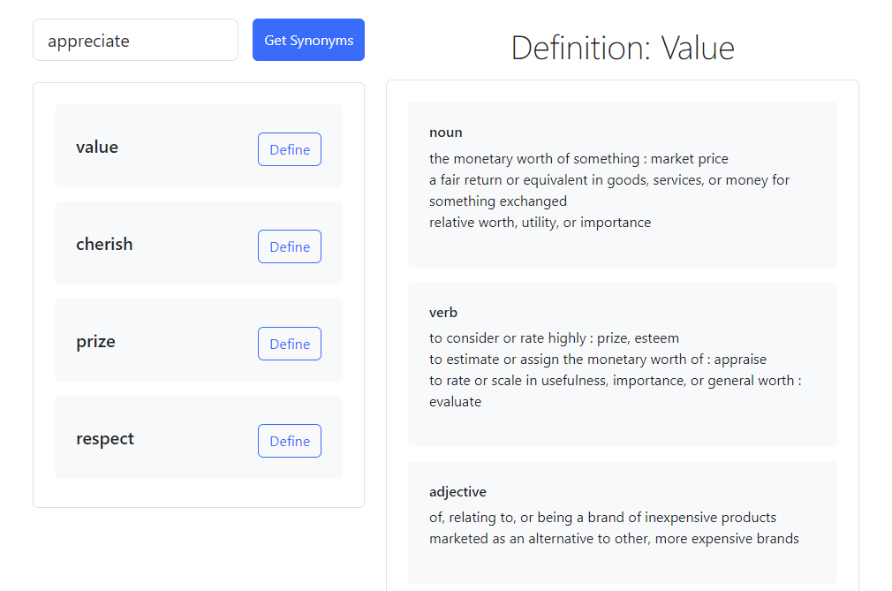
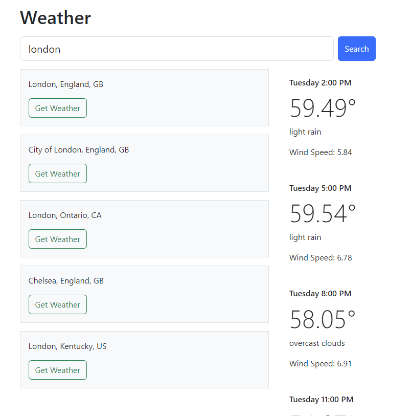
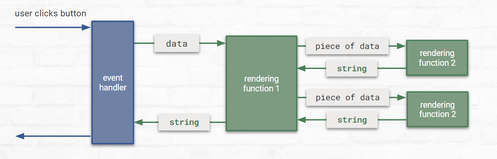

# Project 3: UIs and APIs

## Description

For this project we're going to combine user input and fetching data from an API to make an app. There are three options of apps to build: a Dictionary app, a Weather app, or a Book Reviews app.

## Week 7

This week you'll pick one of the options and write the rendering code. Next week we'll hook it up to an API.

### Task 1: Pick An Option

There are there options for apps you can build this week. They each have a similar flow and will strengthen your UI and API muscles. Pick whichever one seems most interesting to you! 

(And if you'd like more practice, you could come back and build one of the other ones later)

#### Option 1: Dictionary App



**Your app does NOT need to match the screenshot above, that's just a simple example of what it could look like**

In this app, the user will be able to search for all synonyms of a word. While looking at synonyms, they can click on a "Define" button on each synonym to get all definitions of that word.

So the flow of the app will be:

1. The user types a word into a textbox and clicks a Search button
2. The code asks the Collegiate Thesaurus API for a list of synonyms of the word
3. **The code renderes the list of synonyms, each with a Define button**
4. The user clicks one of the Define buttons
5. The code asks the Collegiate Dictionary API for a list of definitions of that word
6. **The code renders the list of definitions**

This week you'll write the code for steps 3 and 6. But the Define button won't work yet, we'll hook that up in Week 9. We'll just render test data: synonyms of the word "appreciate" and the definition of the word "value"

#### Option 2: Weather App



**Your app does NOT need to match the screenshot above, that's just a simple example of what it could look like**

In this app, the user will be able to search for a location by name and see location matches. Then the user can pick one of the location matches and see the 5-day forecast for that location.

So the flow of the app will be:

1. The user types a location name into the textbox and clicks the Search button
2. The code asks the Geocoding API for a list of location matches
3. **The code renders the list of location matches, each with a Get Weather button**
4. The user clicks one of the Get Weather buttons
5. The code asks the 5 Day Weather API for a list of weather forecasts for the location
6. **The code renders the list of weather forecasts**

This week you'll write the code for steps 3 and 6. But the Get Weather button won't work yet, we'll hook that up in Week 9. We'll just render test data: location matches for "London" and the 5-day forecast for London, England

#### Option 3: Books App or News App?

WORK IN PROGRESS

<!-- In this app, the user will be able to search for a book and see books that match the search term. The user can pick one of the books to see reviews for the book.

So the flow of the app will be:

1. The user types a search term into the textbox and clicks the Search button
2. The code asks the Books API for a list of books that match the search term
3. **The code renders the list of books, each with a Reviews button**
4. The user clicks one of the Reviews buttons
5. The code asks the Book Reviews API for a list of reviews of the book
6. **The code renders the list of book reviews**

This week you'll write the code for steps 3 and 6. -->

### Task 2: Copy Test Data

Next week we'll get real data from an API, but this week we just need some test data so we can write the rendering code. Here is test data for each of the three options. Copy the test data for the option you picked.

#### Option 1: Dictionary App

```javascript
// This is an example result from asking the API for synonyms of the word "appreciate"
// This could also just be an array of strings, if you'd like
const SYNONYMS_OF_APPRECIATE = [
    {
        word: "value",
    },
    {
        word: "cherish"
    },
    {
        word: "prize"
    },
    {
        word: "respect"
    }
]

// This is an example result from asking the API for definitions of the word "value"
// There is other definition data available, like the origin and pronunciation, 
// so you could add properties for those if you'd like to display them as well
const DEFINITIONS_OF_VALUE = [
    {
        partOfSpeech: "noun",
        definitions: [
            "The monetary worth of something : market price",
            "a fair return or equivalent in goods, services, or money for something exchanged",
            "of relative worth, utility, or importance"
        ]
    },
    {
        partOfSpeech: "verb",
        definitions: [
            "to consider or rate highly : prize, esteem",
            "to estimate or assign the monetary worth of : appraise",
            "to rate or scale in usefulness, importance, or general worth : evaluate"
        ]
    },
    {
        partOfSpeech: "adjective",
        definitions: [
            "of, relating to, or being a product whose value has been increased especially by special manufacturing, marketing, or processing"
        ]
    }
]
```

#### Option 2: Weather App

```javascript
// This is an example result for asking the Geocoding API for location matches for "London"
const LOCATION_MATCHES_FOR_LONDON = [
    {
        city: "London",
        state: "England",
        country: "GB"
    },
    {
        city: "City of London",
        state: "England",
        country: "GB"
    },
    {
        city: "London",
        state: "Ontario",
        country: "CA"
    },
    {
        city: "Chelsea",
        state: "England",
        country: "GB"
    }
]

// This is just a small section of the data you'll get - a few data points for one day.
// The full forecast will have data points for every 3 hours across 5 days
const FORECAST_FOR_LONDON_ENGLAND = [
    {
        date: Date("8/29/23 2:00 PM")
        temperature: 59.49,
        description: "light rain",
        windSpeed: 5.84
    },
    {
        date: Date("8/29/23 5:00 PM")
        temperature: 59.54,
        description: "light rain",
        windSpeed: 6.78
    },
    {
        date: Date("8/29/23 8:00 PM")
        temperature: 58.05,
        description: "overcast clouds",
        windSpeed: 6.91
    }
]
```

#### Option 3: Book Reviews App or News App?

WORK IN PROGRESS

<!-- ```javascript
const TEST_SECTIONS = [
    {
        title: "Admin"
    },
    {
        title: "Arts"
    },
    {
        title: "Automobiles"
    },
    {
        title: "World"
    }
]

const TEST_ARTICLES = [
    {
        title: "For Migrating Birds, It’s the Flight of Their Lives",
        abstract: "Many of the birds that spend their summers in the United States are preparing to fly south. Here’s where they’re headed — and why it matters.",
        author: "By Emily Anthes",
        publishDate: Date("2023-08-29")
    },
    {
        title: "How to Track a Songbird From Alaska to Peru",
        abstract: "To follow an olive-sided flycatcher, first you have to catch it.",
        author: "By Emily Anthes",
        publishDate: Date("2023-08-29")
    },
    {
        title: "A 12,000-Year-Old Bird Call, Made of Bird Bones",
        abstract: "A collection of small flutes carved from waterfowl bones may have been used as hunting aids, a new study suggests.",
        author: "By Franz Lidz",
        publishDate: Date("2023-08-28")
    }
]
``` -->

### Task 3: Render the Data

To render the data, we'll need to build the HTML using the DOM. There are many ways to do this, but the way we'll use is to write rendering functions that work together to build a large string of HTML, and we'll put that string in an inner HTML property. This will allow us to practice writing functions that call each other, pass parameters, and return values. It's also a common way to handle rendering.

**Write at least 4 rendering functions** that each handle rendering one part of the page and work together by calling each other.

>**Note:** You'll probably end up doing some tweaking of your rendering next week when you get the real data, so don't worry about making it perfect right now, just get the structure you'd like in there.

**Create two buttons and an event handler function for clicking each button** Set it up so that when each button is clicked it renders one set of test data in the page using the innerHTML property. Don't worry about making these buttons nice, we'll rework them in Week 9.

You can use Bootstrap or custom CSS or whatever you'd like to style your HTML.

You could visualize the functions calling each other for one set of data something like this:



### Testing Tasks 1-3

This week is pretty easy to test. 

First, make sure the data is displaying correctly when each button is clicked, and that there are no errors in your console. 

Try making a few changes to your test data, and refreshing and rendering each bit again to make sure the changes are reflected in the page.

### Conclusion

Well this is exciting! We've got data showing up in the page. Hopefully you've learned a lot about working with functions and the DOM. Right now we're just displaying test data, but next week we'll get real data from a real API! 